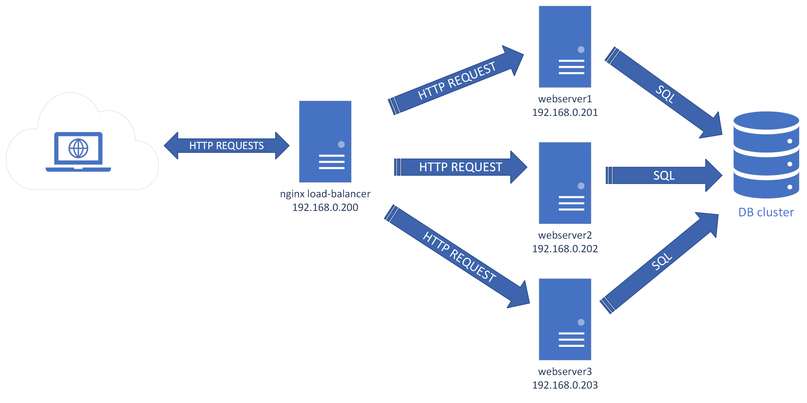

# DISASTER RECOVERY PLAN

### Task
You’ll need to develop a basic disaster recovery plan that includes regular backups, failover procedures, and a plan to quickly restore services in the event of a disaster.

### Approach
+ We are going to backup/restore a mysql database, nginx config directory and application files. 
+ Let's deploy an nginx round-robin load-balancer configuration with 2 additional webservers.

### Steps
1. Backup job must be an automated process, so it's a scheduled bash script. File: [backup_app_database.sh](backup_app_database.sh)
    ```
    crontab -e
    0 2 * * * /root/backup_app_database.sh
    ```

1. Restore process requires human touch, so it's a manual job

    Uncompress last backup
    ```
    cd /mnt/backups
    tar -xzf /mnt/backups/backup_app_files_2023-08-01-185401.tar.gz --strip-components=2
    tar -xzf /mnt/backups/backup_nginx_conf_2023-08-01-185401.tar.gz --strip-components=1
    ```

    Stop nginx
    ```
    systemctl stop nginx
    ```

    Rename old directories
    ```
    mv /etc/nginx /etc/nginx.old
    mv /var/www/html /var/www/html.old
    ```

    Restoring backed up directories
    ```
    mv /mnt/backups/nginx /etc/
    mv /mnt/backups/html /var/www/
    ```

    Restore database 
    ```
    mysql -h server2 -u wpuser -p -e 'drop database wordpress'
    mysql -h server2 -u wpuser -p -e 'create database wordpress'
    mysql -h server2 -u wpuser -p wordpress < backup_app_database_2023-08-01-185401.sql
    ```

    Start nginx
    ```
    systemctl start nginx
    ```

1. Failover implementation proposal
    + There are a few important hacks to sync data between nodes
    + Database is in a cluster

    